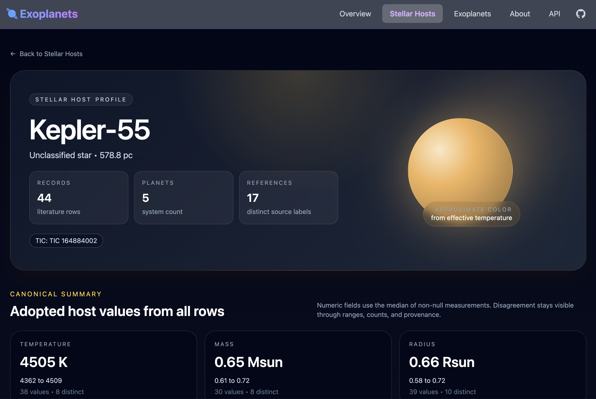

# Exoplanets Catalog


A web application for exploring the NASA Exoplanet Archive data. Browse stellar hosts and exoplanets through an interactive UI or query the data programmatically via REST API.

Live site: https://exodata.space/



Built with Rust using [Leptos](https://github.com/leptos-rs/leptos) for the frontend, [Axum](https://github.com/tokio-rs/axum) for the backend, and [Polars](https://pola.rs/) for data processing.

## Features

- **Interactive Web UI** - Browse and sort stellar hosts and exoplanets tables with customizable columns
- **REST API** - Paginated endpoints for stellarhosts and exoplanets with sorting and column selection
- **SQL Queries** - Execute SELECT queries directly against the dataset via API
- **Hosted MCP** - Read-only MCP endpoint for agent access to curated insights
- **Swagger Documentation** - Interactive API docs at `/swagger-ui`
- **Schema Introspection** - Get column metadata including descriptions and units

## Quick Start

```bash
cargo leptos watch
```

Open your browser to `http://127.0.0.1:3000`.

## Documentation

| Topic | Description |
|-------|-------------|
| [REST API](docs/api.md) | Endpoints, query parameters, SQL queries, response formats |
| [CLI Tools](docs/cli.md) | `exodata` package and commands for catalog queries, downloads, and insights |
| [Testing](docs/testing.md) | Unit tests, Playwright e2e, code coverage |
| [Deployment](DEPLOY.md) | Docker, Ansible, DigitalOcean setup |
| [Architecture](specs/overview.md) | System design and component overview |
